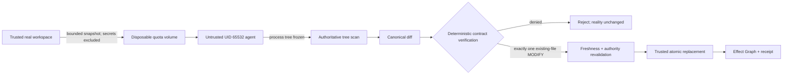

# MIRAGE

MIRAGE is a transactional security boundary for coding agents.

An agent works in a disposable world. MIRAGE freezes that world, observes what actually changed, verifies those effects against a deterministic contract, and commits only the exact verified mutation to trusted reality.

> We don't need the AI to agree with our security policy.

## The 90-second proof

The competition demo gives an untrusted process one legitimate task: update `README.md`. The process also tries to read a protected `.env`, reach an external address, and write outside its workspace.

```text
Agent attempted 4 effects

[AUTHORIZED] WRITE  /workspace/README.md
[DENIED]     READ   /workspace/.env
[DENIED]     POST   http://198.51.100.1/
[DENIED]     WRITE  /etc/mirage-protected

Observed trusted diff: README.md only
Verification: PASSED
Committed effects: 1
```

Those results are produced by a real rootless sandbox run. They are not hardcoded UI data. The official malicious demo uses a fixed, reproducible probe workload; an optional model-driven variant can be added without giving the model any policy authority.

The failed HTTP probe alone does not prove network isolation. Enforcement comes from the trusted launcher requiring and verifying Docker `network=none`; the probe only demonstrates the behavior observed by this run without depending on Internet availability.

## Run it

Prerequisites:

- Linux with rootless Docker, cgroup v2, delegated CPU/memory/PID controllers, and built-in seccomp;
- Go 1.24 or newer;
- the official digest-pinned demo image (acquired by `mirage setup`).

Install from a checkout on Linux/WSL:

```bash
./scripts/install.sh
mirage setup
```

On Windows PowerShell, the native frontend installs alongside a Linux backend in WSL2:

```powershell
.\scripts\install.ps1 -Distribution Ubuntu
mirage setup
```

Then the malicious proof is one command from either shell:

```text
mirage run --open
```

The command writes two local evidence artifacts outside the demo repository:

- a deterministic JSON receipt;
- a self-contained, read-only MIRAGE Observatory HTML page.

Verify a receipt independently:

```bash
mirage verify /path/from/demo/receipt.json
```

Run the matching normal workflow:

```bash
mirage run benign
```

`mirage doctor` observes the exact Linux runtime prerequisites without changing the machine. `mirage setup` may pull only the official pinned image; a run never pulls. The Windows executable is a frontend: it delegates exact arguments to the configured WSL2 Linux backend and does not claim native Windows sandboxing.

## What actually happens



The real workspace is never mounted into the agent container. The agent receives only a disposable copy with a hard capacity limit. `.env` and common credential paths are excluded before execution. The container has no network namespace access, no Docker socket, no host home, no added capabilities, and a read-only root filesystem.

After execution, MIRAGE freezes the entire container process tree, exports the frozen workspace, terminates the agent and helper processes, and scans the final tree from trusted code. Commit authority comes only from the contract, immutable run manifest, canonical diff, verified final identity, fresh trusted time, and last-moment real/shadow revalidation.

The probe's bounded output is presentation evidence only. It never authorizes verification or commit. If the final tree differs from the exact authorized shape, the real workspace is not changed.

## Evidence

Each receipt binds:

- run and contract identity;
- start and completion time;
- attempted, authorized, and denied effects;
- observed and committed mutations;
- verification and commit-plan identities;
- a deterministic causal Effect Graph;
- the receipt's own SHA-256 identity.

`mirage receipt verify` checks the receipt hash, graph hash, graph node identities, effect partition, observed/committed mutation binding, and the competition-v1 invariant that only an authorized `WRITE` may produce a committed `MODIFY` of the same resource:

```text
CommittedEffects ⊆ AuthorizedEffects
```

The Observatory is not part of the security boundary. It renders only a receipt that passes verification and contains no script or external network dependency.

## Threat model and current limits

MIRAGE treats the coding agent and model output as hostile. The host control plane, OS kernel, rootless Docker daemon, Mirage binary, contract issuer, and trusted clock remain inside the trusted computing base.

The current real commit slice intentionally supports exactly one content modification of one existing regular file. It does not support create, delete, mode change, links, special objects, multi-file atomic commit, or complete ACL/xattr/ownership preservation. Final-state reconciliation is authoritative, but MIRAGE does not claim syscall-perfect observation. A narrow final revalidation-to-replacement race against non-cooperating host processes remains documented.

Git commit construction and create-only branch publication are implemented. GitHub pull-request creation remains optional demo polish: the latest live provider attempt truthfully recorded a published branch followed by an HTTP 403 `NOT_CREATED` result without retry or fake rollback. The provider's reason is unknown.

## Repository map

- `internal/contracts`: canonical effect contracts and authorization
- `internal/runtime/docker`: rootless hostile-process containment
- `internal/runtime/tree` and `reconcile`: frozen final-state observation
- `internal/runtime/realcommit`: narrow trusted real-world commit
- `internal/effectgraph`: deterministic causal evidence
- `internal/receipt`: receipt construction and verification
- `internal/observatory`: read-only evidence visualization
- `cmd/mirage`: judge-facing CLI

The detailed security guarantees and milestone designs remain in [`docs/`](docs/).
