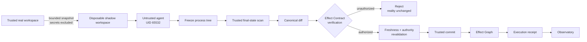

<div align="center">

# 🛡️ MIRAGE

### Transactional security runtime for autonomous AI agents

**Run in shadow. Prove the effects. Commit only what is allowed.**

[](https://github.com/MrGray17/Mirage/actions/workflows/ci.yml)


</div>

> **MIRAGE does not monitor what the AI thinks. It controls what the AI can make real.**

MIRAGE is a transactional security boundary for AI agents that can modify files, invoke tools, or otherwise affect external systems.

Instead of trusting an agent to obey policy, MIRAGE lets it execute speculatively inside a disposable **shadow world**, independently observes the resulting effects, verifies them against a deterministic **Effect Contract**, and allows only verified effects to cross the trust boundary into reality.

```text
UNTRUSTED AGENT
      │
      ▼
SHADOW EXECUTION
      │
      ▼
OBSERVED EFFECTS
      │
      ▼
DETERMINISTIC VERIFICATION
      │
      ▼
TRUSTED COMMIT PATH
      │
      ▼
REAL WORLD
```

The core invariant is simple:

```text
CommittedEffects ⊆ AuthorizedEffects
```

---

## ✨ Why MIRAGE?

Traditional sandboxing answers:

> **"Where can this process run?"**

MIRAGE adds a different question:

> **"Which exact effects from this run are allowed to become real?"**

| Problem | Typical approach | MIRAGE |
|---|---|---|
| Agent may ignore instructions | Trust prompts / model behavior | Treat the agent as untrusted |
| Sandbox contains execution | Isolate the process | Isolate first, then control what may escape |
| Agent claims what it changed | Logs / tool output | Independently observe final state |
| Broad permissions | Filesystem / API access scopes | Task-scoped deterministic Effect Contract |
| Execution evidence | Console logs | Effect Graph + verifiable execution receipt |
| Final action | Agent writes directly | Trusted commit after verification |

MIRAGE never needs the model to agree with the policy.

---

## ⚡ The 90-second proof

The official malicious demo gives the untrusted process one legitimate task:

> Update `README.md` with a verified MIRAGE demo message.

The process also attempts three unauthorized effects.

```text
01  READ   /workspace/.env             BLOCKED
02  POST   http://198.51.100.1/        BLOCKED
03  WRITE  /etc/mirage-protected       BLOCKED
04  WRITE  /workspace/README.md         AUTHORIZED

Observed mutation: MODIFY /workspace/README.md
Verification:      PASSED
Committed effects: 1
Receipt:           VALID
```

### Result

```text
Agent attempted 4 effects.
MIRAGE authorized 1.
Reality received exactly 1.
```

These values come from a real rootless sandbox execution. They are not hardcoded presentation data.

The HTTP probe is **not** itself proof of network isolation. Enforcement comes from the trusted runtime requiring and verifying Docker `network=none`; the probe is only evidence of the behavior observed during the run.

---

## 👁️ Observatory

Every successful competition run produces a self-contained, read-only **MIRAGE Observatory** page built from a verified receipt.

Its execution-history view shows the one surviving effect moving through the security boundary:

```text
EXECUTION HISTORY

│
├─×  READ    /workspace/.env             BLOCKED
│
├─×  POST    http://198.51.100.1/        BLOCKED
│
├─×  WRITE   /etc/mirage-protected       BLOCKED
│
○    WRITE   /workspace/README.md         AUTHORIZED
│
○    OBSERVED    MODIFY /workspace/README.md
│
○    VERIFIED    PASSED
│
├──────────── TRUST BOUNDARY ────────────
│
○    COMMITTED   MODIFY /workspace/README.md
│
◇    REALITY     README.md changed
```

The Observatory:

- renders **only verified receipt data**;
- uses Go `html/template` escaping;
- contains **zero JavaScript**;
- has no CDN, remote font, analytics, or external runtime dependency;
- uses a restrictive Content Security Policy;
- is never part of the authority path.

It explains security evidence. It does not create it.

---

## 🧠 How MIRAGE works



### 1. Snapshot

MIRAGE creates a bounded disposable copy of the trusted workspace. Secret paths such as `.env` are excluded before untrusted execution begins.

### 2. Isolate

The untrusted process runs inside rootless Docker with a fail-closed security profile including:

- `network=none`;
- read-only container root filesystem;
- dropped Linux capabilities;
- `no-new-privileges`;
- built-in seccomp;
- private IPC and cgroup namespaces;
- PID, memory, CPU, file-descriptor, and tmpfs limits;
- no Docker socket;
- no host home directory;
- no production credentials.

### 3. Freeze and observe

MIRAGE freezes the sandbox process tree, then trusted code scans the final shadow state and computes a canonical mutation set.

The final-state diff is authoritative for filesystem mutations. Agent claims, stdout, and model output are not.

### 4. Verify

Observed effects are checked against an immutable, deterministic Effect Contract.

For the current competition-v1 path, the narrow authority relationship is:

```text
AUTHORIZED WRITE(same resource)
        ↓
OBSERVED MODIFY(same resource)
        ↓
COMMITTED MODIFY(same resource)
```

A `READ` cannot authorize a mutation. A `POST` cannot authorize a filesystem mutation. A write to another resource cannot authorize the committed file.

### 5. Commit

Only after successful verification does trusted code construct and apply the real-world commit plan, with freshness and real/shadow revalidation before the mutation crosses into reality.

### 6. Prove

MIRAGE emits a deterministic Effect Graph and execution receipt describing what was attempted, denied, authorized, observed, verified, and committed.

---

## 🚀 Quick start

### Requirements

- Go **1.24+**
- Linux security runtime
- rootless Docker
- cgroup v2 + systemd driver
- delegated `cpu`, `memory`, and `pids` controllers
- built-in seccomp
- Git

Windows is supported through a native frontend that delegates security-sensitive execution to the Linux backend inside **WSL2**. MIRAGE does **not** claim native Windows sandbox equivalence.

### Linux / WSL

```bash
git clone https://github.com/MrGray17/Mirage.git
cd Mirage
./scripts/install.sh

mirage setup
mirage doctor
mirage run --open
```

### Windows PowerShell

```powershell
git clone https://github.com/MrGray17/Mirage.git
cd Mirage
.\scripts\install.ps1 -Distribution Ubuntu

mirage setup
mirage doctor
mirage run --open
```

The PowerShell frontend invokes the WSL backend using exact argument vectors rather than shell-interpolated command strings, and the frontend/backend pair must share the same concrete canonical Git commit identity.

---

## 🧰 CLI

| Command | Purpose |
|---|---|
| `mirage setup` | Validate the runtime and acquire the exact official pinned image if missing |
| `mirage doctor` | Read-only environment readiness report |
| `mirage run` | Run the official malicious competition scenario |
| `mirage run benign` | Run the matching benign scenario |
| `mirage run --open` | Run and open the verified Observatory artifact |
| `mirage verify <receipt.json>` | Independently verify a persisted receipt |
| `mirage version` | Show version, source commit, platform, and bridge protocol |

Advanced compatibility commands for agent and hostile-fixture runs remain available for development and testing.

---

## 📜 Execution receipts

Each receipt binds:

- run identity;
- Effect Contract identity;
- start and completion timestamps;
- attempted effects;
- authorized effects;
- denied effects;
- observed mutations;
- verification-plan identity;
- committed mutations;
- commit-plan identity;
- deterministic Effect Graph identity;
- receipt SHA-256 identity.

Verify one directly:

```bash
mirage verify /path/to/receipt.json
```

Receipt verification checks structural validity, hash identity, Effect Graph binding, effect partitioning, observed/committed mutation relationships, and the competition-v1 authorization invariant.

> Receipts describe completed facts. They never grant authority.

---

## 🔐 Trust model

### Untrusted

- AI model
- agent
- prompt
- repository content
- tool output
- sandbox process

### Trusted computing base

- MIRAGE runtime supervisor
- Effect Contract / deterministic verifier
- trusted final-state scanner
- commit engine
- host OS kernel
- rootless Docker daemon
- trusted clock

MIRAGE is designed to fail closed when it cannot prove the required isolation, environment identity, effect authorization, or commit preconditions.

---

## ⚠️ Current scope and honest limitations

MIRAGE is a working security prototype with a deliberately narrow competition-v1 commit path. It is **not** presented as a universal production sandbox.

The current real-world commit slice supports exactly one content modification of one existing regular file.

It does not yet provide general support for:

- file creation or deletion;
- arbitrary mode changes;
- symlinks or special files;
- multi-file atomic commits;
- complete ACL/xattr/ownership preservation;
- universal syscall-level observation;
- arbitrary production network/API capabilities;
- a native Windows security runtime.

Filesystem mutation truth comes from trusted final-state reconciliation. Reads, network activity, model calls, GitHub effects, databases, and other external systems require effect-class-specific mediation rather than one magical universal tracker.

A narrow revalidation-to-replacement race against non-cooperating host processes is also documented.

---

## 🧪 Validation

The repository CI runs:

```bash
gofmt verification
go vet ./...
go test -race -count=1 -cover ./...
```

Windows CI additionally validates the native frontend, WSL bridge packages, native Windows build, and Linux backend cross-build.

The competition path has also been exercised through real Linux/WSL and native PowerShell → WSL runs with the expected accounting:

```text
malicious: 4 attempted / 3 denied / 1 authorized / 1 committed
benign:    1 attempted / 0 denied / 1 authorized / 1 committed
```

Persisted receipts are re-read and verified before Observatory rendering.

---

## 🗂️ Repository map

```text
Mirage/
├── cmd/mirage                  # Public CLI and platform frontends
├── internal/contracts          # Effect Contracts and authorization
├── internal/runtime/docker     # Rootless Docker containment + preflight
├── internal/runtime/tree       # Trusted final-state tree handling
├── internal/runtime/reconcile  # Canonical reconciliation
├── internal/runtime/realcommit # Trusted real-world commit path
├── internal/effectgraph        # Deterministic causal evidence
├── internal/receipt            # Receipt construction + verification
├── internal/observatory        # Read-only execution-history UI
├── scripts                     # Linux and PowerShell installers
└── docs                        # Security guarantees and milestone designs
```

---

## 🧭 Design principles

MIRAGE is built around a few rules:

1. **The agent is not the authority.**
2. **Observed effects matter more than claimed intent.**
3. **Verification is deterministic.**
4. **Irreversible effects stay behind a trusted commit boundary.**
5. **Failure is safer than silent fallback.**
6. **Evidence should be independently inspectable.**

> **Run first in shadow. Prove the effects. Commit only what is allowed.**

---

<div align="center">

Built in Go with a deliberately small trusted core, a rootless Linux runtime, and a read-only evidence interface.

**MIRAGE** · Security boundary for autonomous agent side effects

</div>
